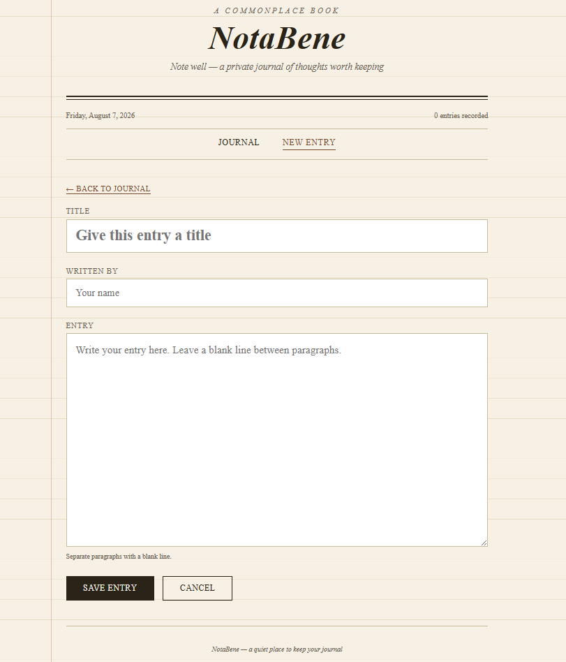

<div align="center">

# 📖 NotaBene

### *Note well.*

A quiet, newspaper-inspired journal for the web — built with nothing but HTML, CSS, and JavaScript.


<br/>

## About

Sometimes you have a thought you don't want to forget, a quote that stays with you, or a day that's worth writing about. **NotaBene** is a simple place to keep those things, without distractions or clutter.

Whether it's an idea that came to you on the way home, notes from a book you're reading, or something that happened today, you can write it down and come back to it whenever you want. Over time, it becomes a collection of your thoughts, memories, and moments that mattered to you.

There's no audience, no likes, and nothing to keep up with. Just a quiet space to write, reflect, and save the things you want to remember.

<br/>

## ✨ Features

| | |
|---|---|
| 📝 **Create entries** | Write freely, whenever a thought is worth keeping |
| 📚 **View all entries** | Browse your journal like the pages of a diary |
| ✏️ **Edit entries** | Come back and revise anything, anytime |
| 🗑 **Delete entries** | Let go of what no longer needs keeping |
| 💾 **Auto-save** | Every entry is saved automatically using browser storage |
| 📱 **Responsive layout** | Reads just as well on a phone as on a desktop |
| 🎨 **Vintage newspaper interface** | Times New Roman, hairline rules, and a warm paper backdrop |

<br/>

<p align="center">
  
</p>

<br/>

## 🛠 Technologies Used

- **HTML5** — structure and semantic markup
- **CSS3** — vintage editorial styling, layout, and responsiveness
- **Vanilla JavaScript** — entry creation, editing, and persistence

No frameworks, no build tools, no dependencies — just open it and start writing.

<br/>

## 🚀 Getting Started

Clone the repository:

```bash
git clone https://github.com/ronyraphel/notabene.git
```

Then simply open `index.html` in your browser.

> No installation, no server, no configuration required.

<br/>

## 🗺 Roadmap

Planned improvements for future versions:

- [ ] 🔍 Search entries
- [ ] 🏷 Categories & tags
- [ ] 🌙 Dark mode
- [ ] 🖋 Rich text editor
- [ ] 📄 Markdown support
- [ ] ☁️ Cloud synchronization

<br/>

## 👤 Author

**Rony Raphel**

<br/>

<div align="center">

*NotaBene — a quiet place to keep the things worth remembering.*

</div>